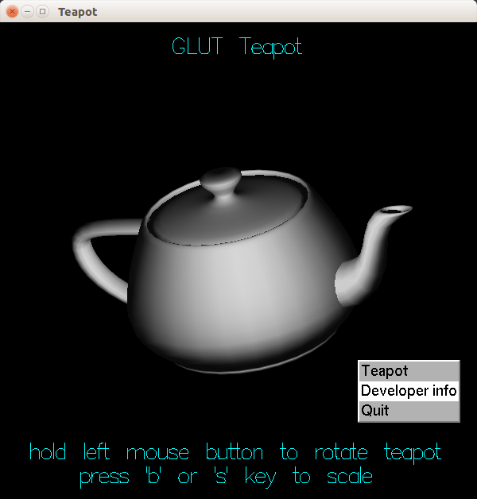
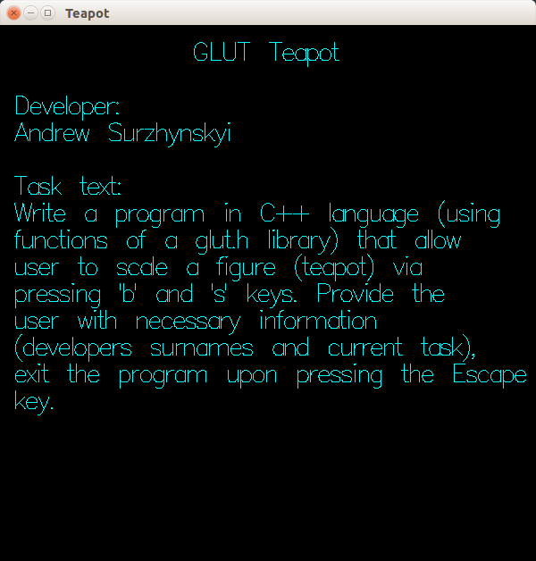

# GLUT Teapot

### Libraries required to compile the program (on Ubuntu linux):
    sudo apt-get install freeglut3-dev libxmu-dev libxi-dev

### Program screenshots

Main screen:

Info screen:

### Task description (English):

Write a program in C++ language (using functions of a glut.h library) that allow user to scale a figure (teapot) via
pressing 'b' and 's' keys.

Provide the user with necessary information (developers surnames and current task), exit the
program upon pressing the Escape key.

### Task description (Ukrainian):

На мові C++ (використовуючи функції бібліотеки glut.h) скласти програму, що дозволяє здійснювати масштабування фігури
(чайника) при натисканні клавіш 'b' і 's'.

Забезпечувати необхідною інформацією користувача (прізвища розробників, поточне завдання), закінчувати роботу в програмі
при натисканні на клавішу Esc.

